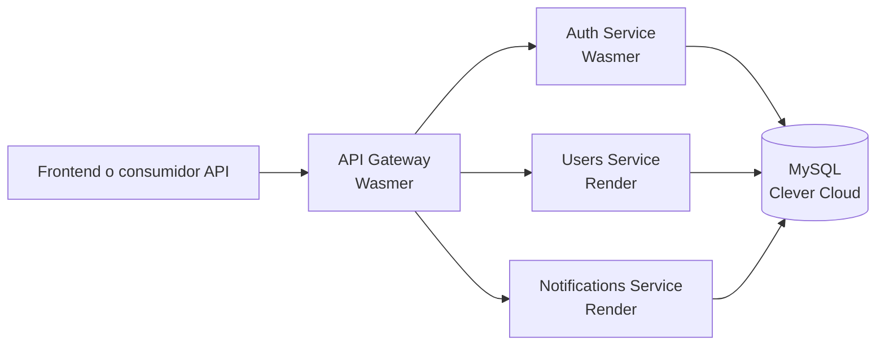

# Plataforma de microservicios para portafolio

Backend API para portafolio construido como un monorepo de cuatro servicios Laravel. Demuestra separación por dominio, API Gateway, OpenAPI interactivo, pruebas automatizadas y despliegue continuo en la nube.

## Demo

**Enlace único para el portafolio:**

[API Gateway — documentación interactiva](https://portfolio-api-gateway.wasmer.app/docs/api/)

Ese enlace es la demostración recomendada porque representa el punto de entrada público del sistema. Desde allí se pueden explorar y probar los flujos de autenticación, clientes, proyectos, tareas, notificaciones y contacto mediante **Try It**.

> La API está diseñada para ser consumida desde el Gateway; los servicios internos también tienen documentación propia para fines técnicos.

## Arquitectura



| Servicio | Responsabilidad | Producción |
| --- | --- | --- |
| `api-gateway` | Punto único de acceso; reenvía solicitudes a los servicios de dominio. | Wasmer |
| `auth-service` | Registro e inicio de sesión. | Wasmer |
| `users-service` | Dashboard, clientes, proyectos y tareas. | Render |
| `notifications-service` | Mensajes de contacto e historial de notificaciones. | Render |

Cada servicio es una aplicación Laravel independiente, con sus propias rutas, configuración, migraciones y pruebas.

## Endpoints principales del Gateway

Base URL: `https://portfolio-api-gateway.wasmer.app/api`

| Método | Ruta | Acción |
| --- | --- | --- |
| `GET` | `/health` | Verifica el estado del Gateway. |
| `POST` | `/v1/auth/register` | Registra un usuario. |
| `POST` | `/v1/auth/login` | Inicia sesión. |
| `GET` | `/v1/dashboard` | Obtiene métricas operativas. |
| `GET`, `POST` | `/v1/clients` | Lista o crea clientes. |
| `GET`, `POST` | `/v1/projects` | Lista o crea proyectos. |
| `GET`, `POST` | `/v1/tasks` | Lista o crea tareas. |
| `GET` | `/v1/notifications` | Lista notificaciones. |
| `POST` | `/v1/contact` | Registra un mensaje de contacto. |

Los endpoints `POST` están documentados con esquemas OpenAPI explícitos. Por ejemplo, el registro solicita `name`, `email` y `password`; la interfaz **Try It** presenta esos campos para hacer pruebas.

## Documentación OpenAPI

La documentación utiliza [Dedoc Scramble](https://scramble.dedoc.co/) y Stoplight Elements.

| Servicio | Documentación |
| --- | --- |
| API Gateway | https://portfolio-api-gateway.wasmer.app/docs/api/ |
| Auth Service | https://portfolio-auth-service.wasmer.app/docs/api/ |
| Users Service | `https://portfolio-users-service.onrender.com/docs/api` |
| Notifications Service | `https://portfolio-notifications-service.onrender.com/docs/api` |

En Wasmer, el documento OpenAPI se exporta en CI como archivo estático (`public/docs/api.json`). Esto evita incompatibilidades del runtime PHP/WASI con la generación dinámica de Scramble. La interfaz conserva el mismo motor visual utilizado por Scramble en Render.

## Cómo probar la demo

1. Abre el enlace de demo del Gateway.
2. Expande un endpoint `POST`, por ejemplo **Registrar usuario**.
3. Pulsa **Try It** y completa los campos del formulario.
4. Ejecuta la petición y revisa la respuesta JSON y su código HTTP.
5. Para un flujo completo, crea un cliente, usa su identificador para crear un proyecto y usa el identificador del proyecto para crear una tarea.

También se incluye una colección de Postman en [postman/portfolio-microservices.postman_collection.json](postman/portfolio-microservices.postman_collection.json) y el entorno local en [postman/portfolio-microservices.postman_environment.json](postman/portfolio-microservices.postman_environment.json).

## Ejecución local

### Requisitos

- PHP 8.3+
- Composer
- MySQL para ejecutar los servicios localmente

### Preparar y ejecutar

En cada servicio, instala dependencias, crea el entorno y aplica sus migraciones.

```bash
cd services/auth-service
composer install
copy .env.example .env
php artisan key:generate
php artisan migrate
php artisan serve --host=127.0.0.1 --port=8001
```

Repite el proceso para los demás servicios usando estos puertos:

| Servicio | Puerto local |
| --- | --- |
| Auth Service | `8001` |
| Users Service | `8002` |
| Notifications Service | `8003` |
| API Gateway | `8000` |

Configura las URL de los servicios en el `.env` del Gateway antes de iniciarlo. El Gateway lee esas variables a través de [services/api-gateway/config/services.php](services/api-gateway/config/services.php), por lo que sigue funcionando incluso cuando Laravel almacena la configuración en caché.

## Pruebas

Cada microservicio tiene pruebas Feature para sus endpoints y/o contrato OpenAPI. Ejecuta las pruebas dentro del servicio que modifiques:

```bash
cd services/api-gateway
php artisan test --compact
```

El contrato del Gateway verifica que los cuerpos de las peticiones `POST` incluyan los campos que la interfaz interactiva necesita y que el Gateway reenvíe los datos al servicio correspondiente.

## CI/CD y despliegue

El flujo de GitHub Actions está en [.github/workflows/wasmer-deploy.yml](.github/workflows/wasmer-deploy.yml).

En cada `push` a `main`:

1. Ejecuta las pruebas de los cuatro servicios.
2. Despliega Auth Service y API Gateway a Wasmer.
3. Para cada aplicación Wasmer, genera un OpenAPI estático usando SQLite temporal y sus migraciones.
4. Publica una nueva versión del paquete de Wasmer sin guardar secretos en el repositorio.

Users Service y Notifications Service se despliegan en Render mediante el blueprint [render.yaml](render.yaml). Los Dockerfiles de cada uno preparan las dependencias, directorios de cache de Laravel y ejecutan las migraciones de producción.

### Variables de producción

Las claves, credenciales MySQL y tokens se configuran exclusivamente en Wasmer, Render o GitHub Secrets. No deben incluirse en archivos `.env`, YAML o commits públicos.

Variables importantes:

- Wasmer: `APP_KEY`, base de datos de Clever Cloud y URLs de los servicios.
- Render: `APP_KEY`, credenciales de Clever Cloud y URLs de los servicios.
- GitHub Actions: `WASMER_TOKEN` y `WASMER_OWNER`.

## Cómo presentarlo en tu portafolio

Usa un único botón o tarjeta de proyecto con el enlace de demo del Gateway:

- **Título:** Plataforma de microservicios Laravel
- **Descripción corta:** API backend modular con API Gateway, autenticación, gestión de proyectos, notificaciones, OpenAPI interactivo y CI/CD.
- **Demo:** https://portfolio-api-gateway.wasmer.app/docs/api/
- **Repositorio:** https://github.com/laguyu/microservicios-laravel
- **Tecnologías:** Laravel, PHP 8.3, MySQL, Clever Cloud, Wasmer, Render, GitHub Actions, OpenAPI y Postman.

La documentación del Gateway permite demostrar el producto con un enlace único, sin obligar al visitante a conocer la topología interna de los microservicios.

## Guía técnica

Para una explicación sin necesidad de conocer Laravel, consulta [docs/guia-tecnica-para-no-laravel.md](docs/guia-tecnica-para-no-laravel.md).

## Licencia

MIT
