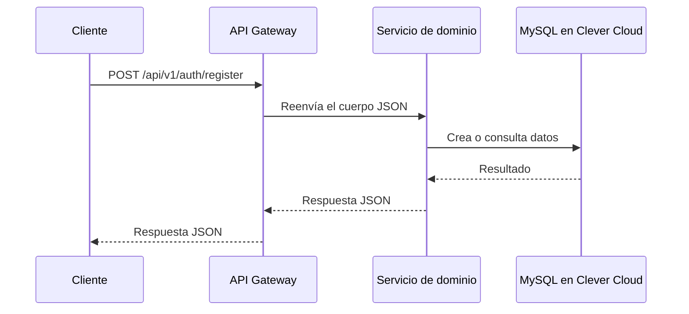

# Guía técnica de la arquitectura

## Objetivo del proyecto

Este repositorio es una demostración de backend para portafolio. En lugar de concentrar todo en una única aplicación, separa las responsabilidades principales en cuatro servicios independientes. La meta es mostrar decisiones de ingeniería reales: organización por dominio, comunicación entre servicios, documentación de API, pruebas y despliegue automatizado.

No es necesario conocer Laravel para entender el diseño: cada servicio es una aplicación que recibe solicitudes HTTP, procesa datos y devuelve respuestas JSON.

## La idea de microservicios

Un microservicio es una aplicación pequeña dedicada a una responsabilidad concreta. En este proyecto:

- **Auth Service** se ocupa de registrar usuarios e iniciar sesión.
- **Users Service** administra clientes, proyectos y tareas.
- **Notifications Service** registra contactos y notificaciones.
- **API Gateway** es la puerta de entrada única para quien consume la API.

Esta división evita que una sola aplicación acumule responsabilidades distintas. Cada servicio puede evolucionar, probarse y desplegarse de manera independiente.

## Recorrido de una solicitud

El cliente no necesita decidir si un endpoint pertenece a autenticación, usuarios o notificaciones. Usa una sola URL pública del Gateway, y este envía la petición al servicio apropiado.

## Responsabilidades de cada servicio

### Auth Service

Expone registro e inicio de sesión. Valida los datos recibidos, persiste usuarios y devuelve una respuesta con información de usuario y un token JWT de acceso.

Rutas principales:

- `POST /api/v1/auth/register`
- `POST /api/v1/auth/login`

### Users Service

Representa la parte operativa de un negocio o portafolio profesional. Sus endpoints están protegidos con `Authorization: Bearer <token>`. Gestiona:

- dashboard de métricas;
- clientes;
- proyectos asociados a clientes;
- tareas asociadas a proyectos.

### Notifications Service

Recibe mensajes de contacto y conserva un historial de notificaciones. Sus endpoints también están protegidos con `Authorization: Bearer <token>`. Es un dominio separado porque la comunicación suele crecer de forma distinta a la lógica de clientes y proyectos.

### API Gateway

El Gateway concentra el acceso público. Sus controladores documentan explícitamente los cuerpos de cada solicitud `POST`, reenvían la petición al servicio de dominio y retornan el código y el JSON recibidos.

Las rutas públicas del Gateway son autenticación (`/api/v1/auth/register` y `/api/v1/auth/login`) y `health`. El resto de rutas de negocio requiere token JWT válido.

Las URL internas de los servicios se resuelven mediante configuración de Laravel, no llamando variables de entorno directamente desde las rutas. Esto permite que el servicio funcione correctamente cuando la configuración se almacena en caché en producción.

## Base de datos y configuración

La base de datos productiva usa MySQL en Clever Cloud. Las credenciales se inyectan por variables de entorno en cada plataforma de hosting y nunca se guardan en el repositorio.

En producción, las variables relevantes incluyen:

- `APP_KEY`
- `DB_CONNECTION`, `DB_HOST`, `DB_PORT`, `DB_DATABASE`, `DB_USERNAME`, `DB_PASSWORD`
- `AUTH_SERVICE_URL`, `USERS_SERVICE_URL`, `NOTIFICATIONS_SERVICE_URL`

Las variables contienen infraestructura y secretos; el código utiliza archivos de configuración para leerlas de forma segura y compatible con la caché de Laravel.

## Documentación de la API

Cada servicio utiliza Dedoc Scramble para construir un contrato OpenAPI. Este contrato describe rutas, campos, formatos, respuestas posibles y requerimientos de seguridad Bearer donde aplica.

La interfaz interactiva usa Swagger UI. Al abrir una ruta `POST` y seleccionar **Try it out**, muestra los campos definidos para esa operación. Por ejemplo, el registro ofrece `name`, `email` y `password`.

### Diferencia entre Render y Wasmer

- **Render** sirve la documentación dinámica generada por Scramble.
- **Wasmer** sirve Swagger UI con un archivo OpenAPI estático.

El enfoque estático en Wasmer es intencional. El runtime PHP/WASI de Wasmer no es compatible de manera fiable con la generación dinámica de Scramble. GitHub Actions genera `public/docs/api.json` antes de desplegar, y Wasmer solo entrega ese archivo y la interfaz web. El visitante obtiene la misma experiencia de documentación sin provocar errores de runtime.

## Hosting

La aplicación usa una estrategia híbrida para aprovechar el límite disponible de aplicaciones de Wasmer:

| Plataforma | Servicios |
| --- | --- |
| Wasmer | API Gateway y Auth Service |
| Render | Users Service y Notifications Service |
| Clever Cloud | MySQL de producción |

El Gateway mantiene una URL pública única y se comunica con los servicios alojados en ambas plataformas.

## Automatización con GitHub Actions

El workflow de despliegue sigue este proceso en cada cambio que llega a la rama `main`:

1. Instala las dependencias de cada servicio.
2. Ejecuta las pruebas de Laravel de los cuatro servicios.
3. Para Auth Service y API Gateway, crea una SQLite temporal y aplica las migraciones.
4. Exporta el contrato OpenAPI estático necesario para Wasmer.
5. Publica Auth Service y API Gateway en Wasmer.
6. Render detecta los cambios de Users Service o Notifications Service y reconstruye sus contenedores Docker.

La SQLite temporal es solo una herramienta de CI. Evita que el análisis de documentación intente conectarse a MySQL local o de producción durante la publicación.

## Cómo probarlo

### Demo pública

El punto de entrada recomendado es:

https://portfolio-api-gateway.wasmer.app/docs/api/

Desde esta URL se pueden ejecutar solicitudes de ejemplo y comprobar los campos, códigos HTTP y respuestas JSON. Para endpoints privados, primero debes obtener JWT en login/register y autorizar con `Bearer <token>` desde el botón **Authorize**.

### Postman

El repositorio incluye una colección de Postman y un entorno local. Importa ambos archivos desde la carpeta `postman/`, selecciona el entorno y ejecuta las solicitudes en orden: registro, cliente, proyecto y tarea.

### Pruebas automatizadas

Cada servicio contiene pruebas Feature. El Gateway tiene pruebas específicas para:

- disponibilidad del health check;
- documentación de campos de `POST`;
- reenvío del cuerpo de registro con un cliente HTTP simulado.

## Presentación en un portafolio con un solo enlace

Si tu portafolio solo admite una URL de demo, utiliza el enlace de documentación del API Gateway:

https://portfolio-api-gateway.wasmer.app/docs/api/

Texto sugerido para la tarjeta:

> **Plataforma de microservicios Laravel** — API backend modular con Gateway, autenticación, gestión de clientes/proyectos/tareas, notificaciones, MySQL en la nube, OpenAPI interactivo y despliegue automatizado con GitHub Actions.

Ese enlace es suficiente porque enseña la API pública y permite probar los flujos sin revelar ni exigir navegación por la infraestructura interna.
